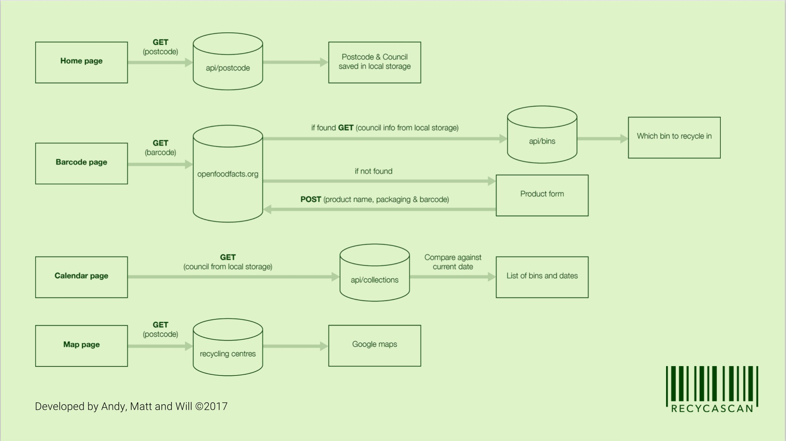

# Recycascan

Hello welcome to Will, Matt and Andys React Native mobile app - Recycascan! This app was the final project during Northcoders full stack web development course. The app was built with React Native and is currently compatible with android mobile operating systems.

# Recycascan features
Recycascan can with the users postcode, scan food packaging barcodes and tell the user which recycling waste bin to put the packaging in. Recycascan can differentiate between different councils' requirements for different packaging to be put into different colour bins. The app also has a calendar which shows which bins will be collected on a particular day also depending on the users local council collections. Lastly there is a map which shows all the main recycling centres local to the users postcode location.

# Demonstration

- Please click the link for a brief video of the app

- [Recycascan](https://www.youtube.com/watch?v=IUdKmzv3k6M)

# Prerequisites

- To run this project you will need node.js installed locally. Make sure you allow installation of apps from other sources in your android security settings. 

# Installing the app

- Clone the repository 
```
 git clone https://github.com/mj-e/recycascan.git
 ```

- Install dependencies 
```
 npm install
 ```

- To build the app and run on android mobile devices run command below and make sure your device is connected to your machine
```
 react-native run-android
 ```

- To run the test environment locally 
``` 
npm run mocha
```

# Download 

- An apk version of the app can be downloaded from here - 

[Download](https://recycascan.herokuapp.com/)

# App architecture



# Built With

* [React Native](https://facebook.github.io/react-native/) 
* [React Native Maps](https://github.com/airbnb/react-native-maps) 
* [React Native Camera](https://github.com/lwansbrough/react-native-camera) 
* [React Native form generator](https://github.com/MichaelCereda/react-native-form-generator)
* [React Native vector icons](https://github.com/oblador/react-native-vector-icons)
* [Axios](https://github.com/mzabriskie/axios)
* [Express](https://expressjs.com/) 
* [Mongoose](http://mongoosejs.com/) 
* [Async JS](http://caolan.github.io/async/)
* [Moment JS](https://momentjs.com/) 
* [Underscore JS](http://underscorejs.org/) 